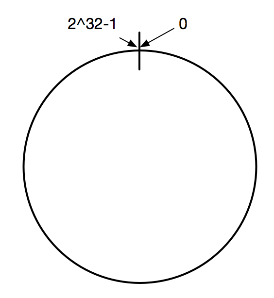
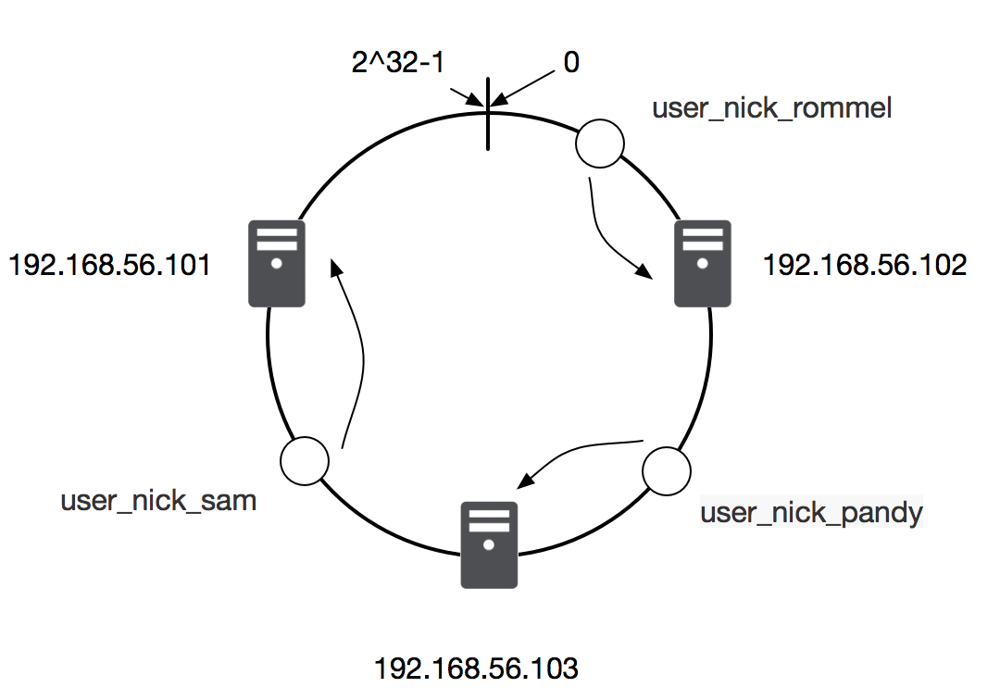
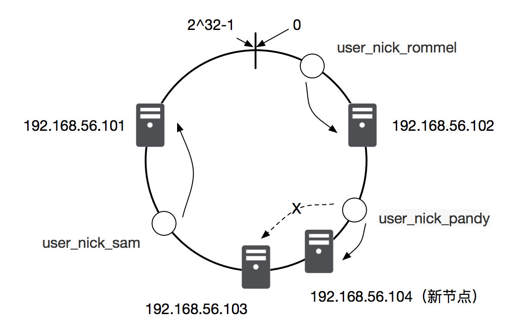
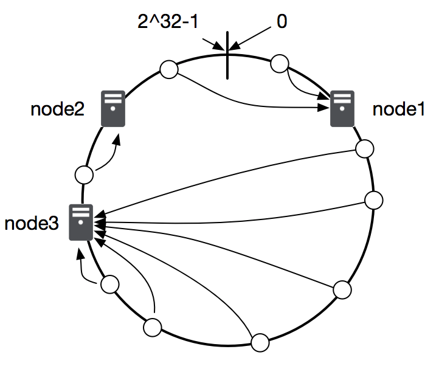

**常用算法**

** 1.一致性HASH算法 **

​ 在一致性哈希算法中，首先将哈希空间映射到一个虚拟的环上，环上的数值分从 0 到 2^32-1（哈希值的范围），如下图：
  
  
  

  在一致性哈希算法刚提出来的时候，32位系统还是主流，2^32-1 相当于最大Integer，现在的应用服务器普遍都是64位系统，在使用使用一致性哈希算法时可以根据实际情况适当变通，比如将哈希值空间放大到 2^64-1。
​ 然后使用同样的哈希算法将缓存服务节点（通常通过服务器IP+端口作为节点的key）和数据键映射到环上的位置。再决定数据落在那台服务器上时，使用一致的方向（比如顺时针方向）沿环查找，遇到的第一个有效服务器就是缓存保存的地方，如图：

  
  

​ 当有新的服务器节点加入时，按照同样的哈希算法将新节点映射到环上的某处位置，和新节点相邻的数据逆时针节点会进行迁移，其他节点保持不变。如下图，当新加入一台新服务器 192.168.56.104 时，user_nick_pandy 这条缓存数据的请求根据算法会落在192.168.56.104 这台及其上，其他节点不受任何影响。

   
​
​ 另外，由于哈希计算的记过通常都比较随机，如果缓存服务器比较少的话，可能会出现数据分配冷热不均的问题，如下图所示，大部分数据都会存储在 node3 节点上。

   

​ 为了解决这个问题，我们引入虚拟节点的概念，在实体服务器不增加的情况下，用多个虚拟节点替代原来的单个实体节点，一台服务服务器在环上就对应多个位置，这样可以让数据存储更加均匀，各服务器的负载页更加平衡，如图：
